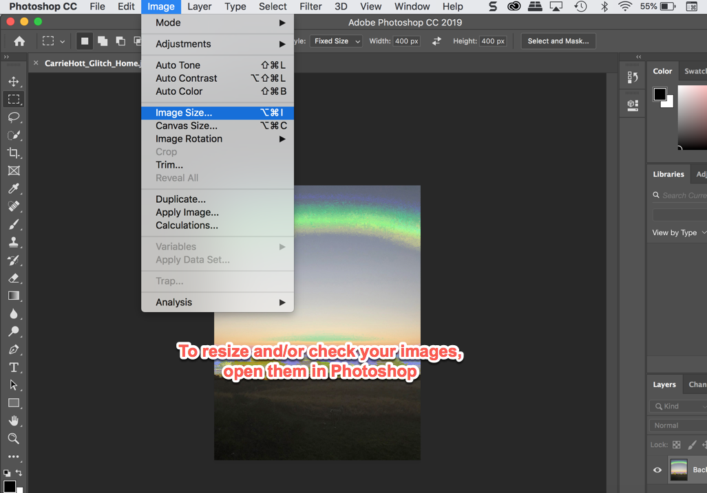
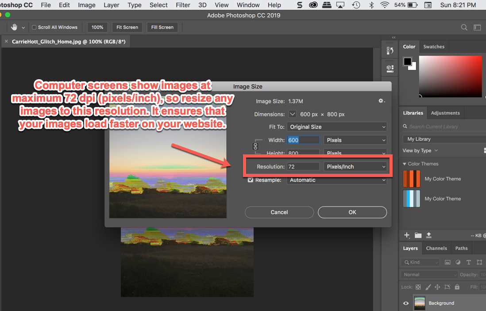
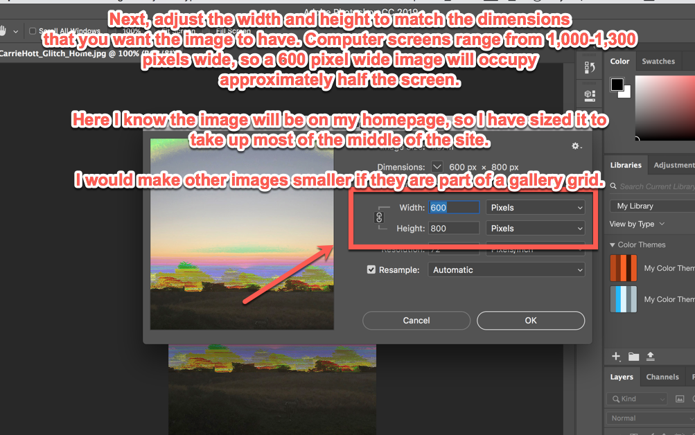
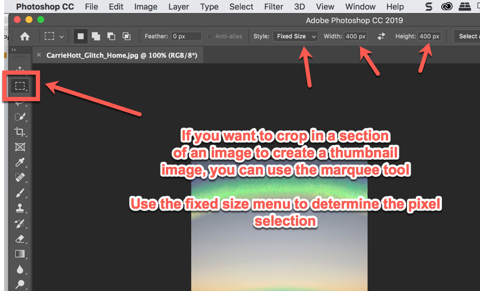
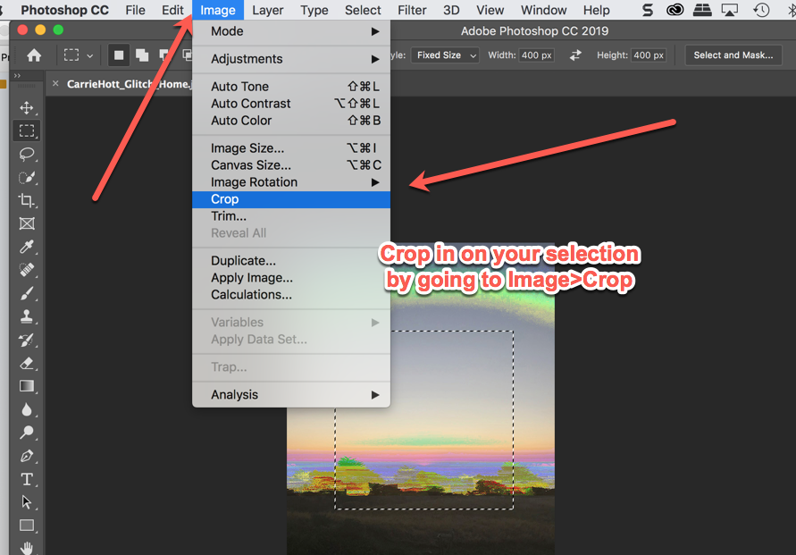
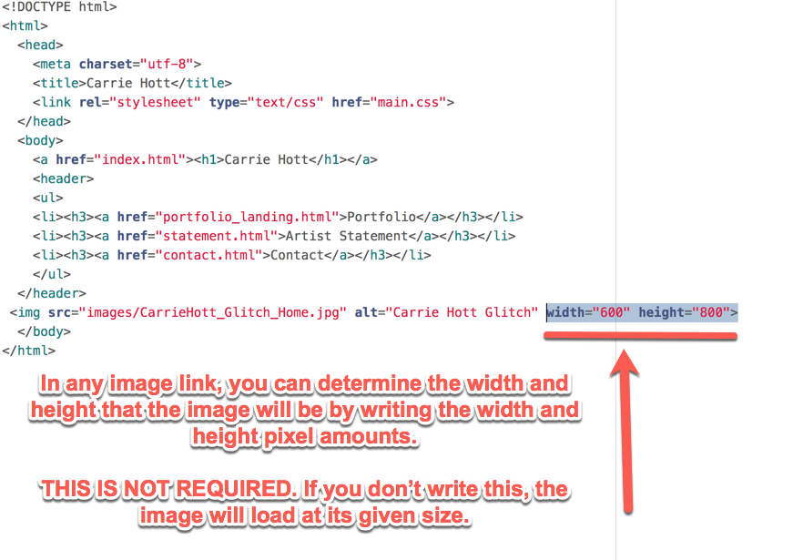
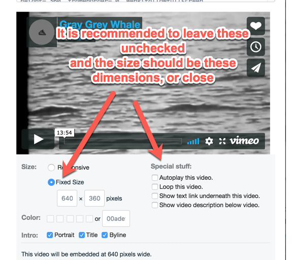
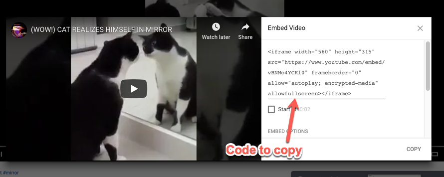
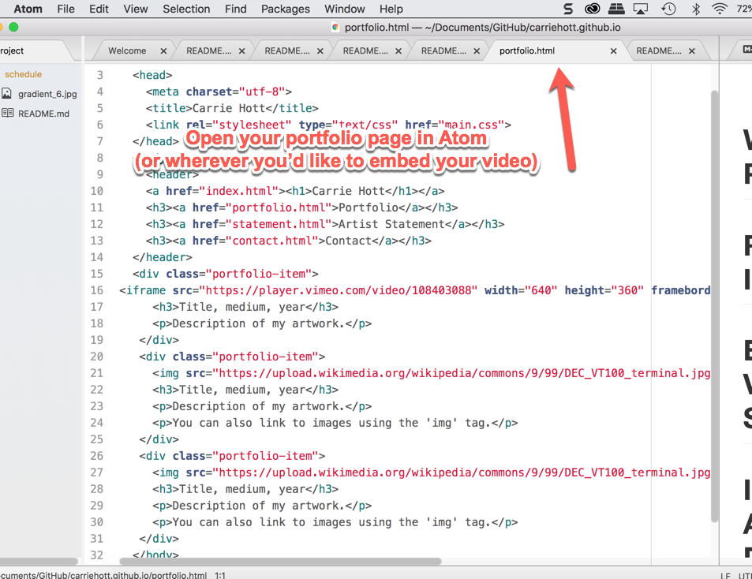
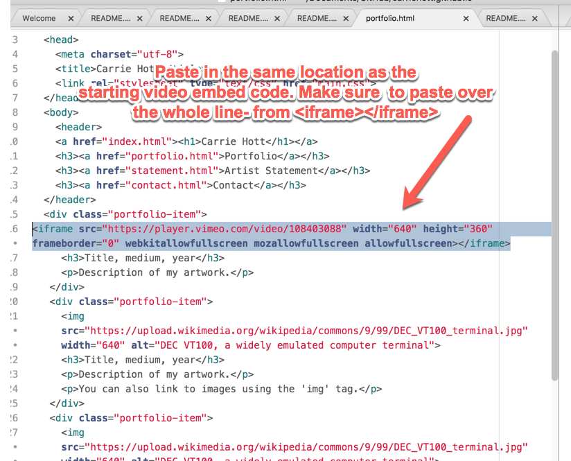

# Portfolio Website Content and Writing Tips!
## Here are some tips, guides, and resources for adding images, video, project descriptions, and your artist statement to your portfolio website.

 ◇─◇──◇────◇────◇────◇────◇────◇─◇─◇
 

#### **On this page:**
1. [What Is This Page For? ](#what-is-this-page-for)
2. [Tips on making artist portfolios](#-tips-on-making-artist-portfolios)
3. [Artist Statements](#artist-statements)
4. [Individual Artwork Descriptions](#individual-artwork-descriptions)
5. [Resizing Images](#resizing-images)
6. [Embedding Videos](#embedding-videos)

# What Is This Page For
After building the structure of your portfolio website, your next task is to add your work, descriptions of your work, and your artist statement. This page provides resources for these content pieces of your website.

# Tips on making artist portfolios

Your portfolio should represent YOU and YOUR WORK.

It will be hard to do this as a student, since you are still figuring out what kind of work you make. Getting you in the practice of writing and presenting your work in a web portfolio is the goal for now.

For this class, I am looking for:

1. Basic web design (using the code from the [gitHub pages demo](https://github.com/katerhoades/GithubSetup/blob/master/README.md) would be fine)

2. Documentation of the projects you made for this class, with short descriptions about the CONCEPTS behind each piece (details below)

3. A two-paragraph artist statement (more details below)

 

# Artist Statements

Your artist statement should be approximately 250 words long.  Remember that the artist statement is a chance to tell the reader what you do and why you do it. **Start from where you are- speak directly and clearly and be honest. It's okay if you're just starting to make art and your statement is shorter. You're just getting started.**

250 words is usually two paragraphs:

**First Paragraph** 
Who are you and what do you care about as an artist? What kind of subjects do you explore in your work? Identify the medium or mediums you work in and what process you use. Also address other issues that are important (how does your work connect to the outside world? developing technologies?) 
 
**Second Paragraph** 
Expand on the first paragraph and describes more of your process, or a specific project and how it is an example of your overall way of working. How does the approaches you take in your work reflect your interests? What do you do to explore the ideas outlined in paragraph 1?

**HIGHLY RECOMMENDED Resources:**
* [How to Write An Artist Statement by Sarah Hotchkiss on The Creative Independent](https://thecreativeindependent.com/guides/how-to-write-an-artist-statement/)
* [Example Artist Statements on "Getting your Sh*t Together"](https://www.gyst-ink.com/sample-artist-statements/)

 

# Individual Artwork Descriptions

On your website, there are areas under your individual artworks for brief descriptions. These descriptions should be short (maximum 2-3 sentences) and clear descriptions of your concept and process.

Imagine these as a description on the wall of a gallery. What information do you want/need to convey to the viewer for them to understand the piece as you intended it?

Here are some examples of descriptions and format for title and medium:

**"Title (in quotations)", Digital Video, 4 min, 2018**

This piece is an exploration of networked society and how compulsory sharing on social media is eroding our rights to digital privacy. Because this monitoring typically goes unnoticed, I substituted very large surveillance cameras in the place of my mouse while browsing the internet. The video is a screen capture of that experience.

**"Title", Installation with Digital Video, cardboard, hot dog buns, 2018**

I used hot dog buns filled with cardboard as a metaphor to the toxicity of cultural norms in the United States. News footage is projected onto the cardboard standing in for the hotdogs, comparing government propaganda to hot dogs, a symbol of American consumption.

# Resizing Images
**Why is it important to resize your images for the web?** When your images are sized to match the same dimensions and resolution as displayed on your website, they load faster. Computer screens generally have a max resolution of 72 dpi. If your image is larger, then the computer loading your site has to resize your images before displaying them. When you size your images correctly, the computer showing your website doesn't have to adjust the size from the original file size in your website folder to the display size on the screen, so they load faster.

After you resize, you can further compress jpgs and pngs using an online compresser like [tinyjpg.com](https://tinyjpg.com/).

### **Resizing for web:**

### **Creating Thumbnails:**

### **HTML width and code in the image tag:**

All of your images will load at the size you determined in Photoshop UNLESS you write in a specific width and height in the image tag in your HTML document. This is only necessary when you need the image to load at a specific size that is different from the original file size. Example below:

# Embedding Videos
You can embed your video directly from vimeo or youtube using the HTML iframe tag. Here is a step by step guide:

### Video from Vimeo and YouTube

 
 

 
 

 
 

 
 

 
 

 
 

 
 

 
 

 
 
**Preview and watch your video on your portfolio page!**
